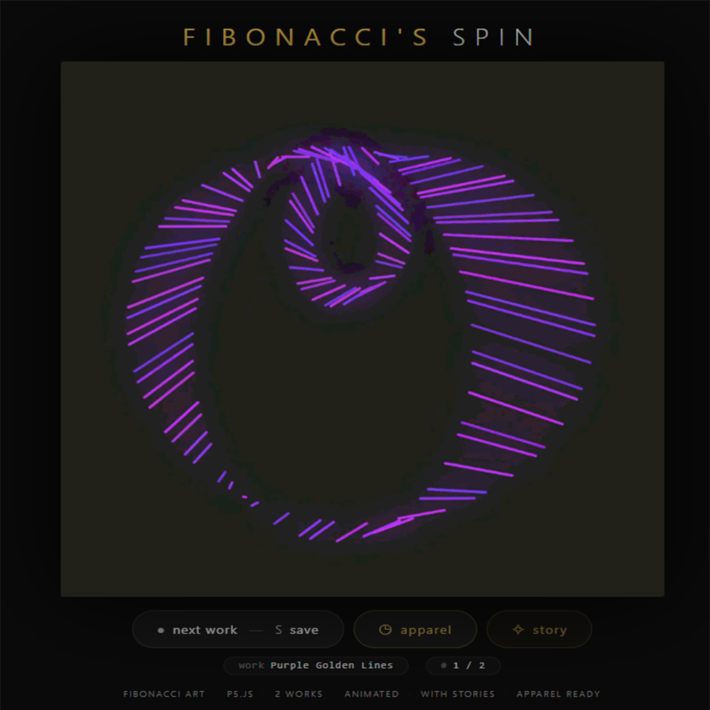
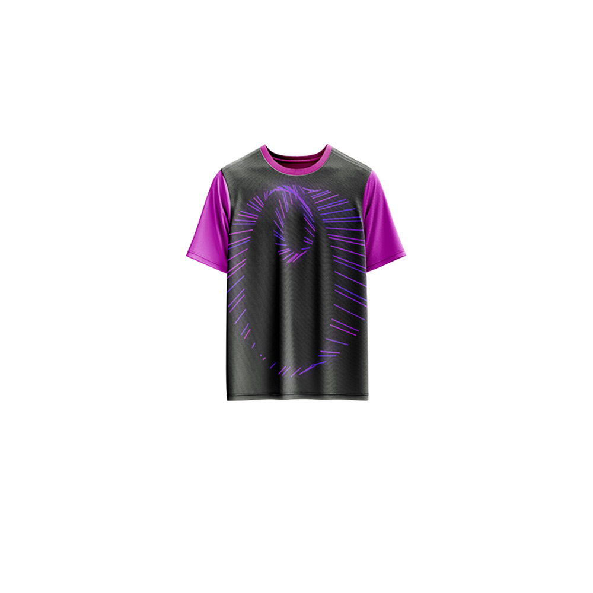

# Fibonacci's Spin — Generative Art

[](https://reyrove.github.io/Fibonaccis-Spin-Generative-Art)
[](https://opensource.org/licenses/MIT)

> **Generative art meets the Fibonacci sequence.** A collection of 2 animated artworks exploring the mathematical beauty of the golden ratio through spinning lines and dancing ellipses.

## 🎨 Live Demo

<div align="center">
  <a href="https://reyrove.github.io/Fibonaccis-Spin-Generative-Art" target="_blank">
    
  </a>
  <br><br>
  <a href="https://reyrove.github.io/Fibonaccis-Spin-Generative-Art" target="_blank">
    
  </a>
  <br>
  <em>Click the image or button to experience the generative art</em>
</div>

## 👕 Apparel Preview

<div align="center">
  
  <br>
  <em>Fibonacci's Spin artwork printed on a T-shirt</em>
</div>

## ✨ Features

- **2 Unique Animated Works** — Exploring the Fibonacci sequence and golden ratio
- **Mathematical Beauty** — Fibonacci numbers, golden ratio, and geometric harmony
- **Animated GIFs** — Both artworks come to life with motion
- **Rich Storytelling** — Each artwork has a narrative story
- **Slideshow Navigation** — Browse through the collection
- **Save & Share** — Download any artwork as GIF
- **Apparel Mode** — Preview artwork on a T-shirt mockup
- **Responsive** — Works on desktop, tablet, and mobile
- **Keyboard Shortcuts**:
  - `→` or `N` — Next work
  - `←` or `P` — Previous work
  - `Space` — Next work
  - `S` — Save image
  - `A` — Toggle apparel
  - `C` — Toggle story

## 🎯 Artworks

| # | Title | Description |
|---|-------|-------------|
| I | **Purple Golden Lines** | A mesmerizing dance of purple and golden lines, where a four-link and three-link mechanism create a symphony of motion guided by the Fibonacci sequence. |
| II | **Cyan Golden Ellipses** | 55 cerulean ellipses pirouette across the canvas at 31 frames per second, each orbiting in perfect harmony dictated by the golden ratio. |

## 🔢 The Fibonacci Sequence

The Fibonacci sequence is a series of numbers where each number is the sum of the two preceding ones:

```
1, 1, 2, 3, 5, 8, 13, 21, 34, 55, 89, 144, 233...
```

This mathematical pattern appears throughout nature—in sunflowers, pinecones, and spiral galaxies—and forms the foundation of these generative artworks.

## 🚀 Quick Start

### Local Development

```bash
# Clone the repository
git clone https://github.com/reyrove/Fibonaccis-Spin-Generative-Art.git

# Navigate to the directory
cd Fibonaccis-Spin-Generative-Art

# Open in browser
open index.html
# or use a live server
```

### Deploy to GitHub Pages

1. Push to GitHub
2. Go to Settings → Pages
3. Select branch `main` and root folder
4. Your site will be live at `https://reyrove.github.io/Fibonaccis-Spin-Generative-Art`

## 🧠 How It Works

### Purple Golden Lines
- **Mechanism Design**: Four-link mechanism for line beginnings, three-link mechanism for line endings
- **Length Determination**: Link lengths based on Fibonacci sequence numbers
- **Animation**: Continuous rotation creating mesmerizing patterns
- **Color Palette**: Purple and gold hues

### Cyan Golden Ellipses
- **55 Ellipses**: Each with unique size and orbital period
- **Fibonacci Scaling**: Sizes cascade in perfect harmony
- **Orbital Periods**: Range from 3.22 seconds (largest) to 0.1 seconds (smallest)
- **31 FPS**: Smooth animation at 31 frames per second
- **Golden Ratio**: Positions calculated using divine proportions

## 📁 File Structure

```
Fibonaccis-Spin-Generative-Art/
├── index.html                  # Main application (all-in-one)
├── purple-golden-lines.gif     # Artwork 1 (animated)
├── cyan-golden-ellipses.gif    # Artwork 2 (animated)
├── Fibonaccis-Spin.jpg         # T-shirt mockup image
├── fav.svg                     # Favicon
├── demo-screenshot.jpg         # Website demo screenshot
├── README.md                   # This file
└── LICENSE                     # MIT License
```

## 🛠️ Tech Stack

- **Vanilla HTML/CSS/JS** — No dependencies
- **p5.js** — Generative art creation
- **CSS Flexbox/Grid** — Responsive layout
- **GitHub Pages** — Hosting

## 🎯 Interactive Controls

| Action | Keyboard | Button |
|--------|----------|--------|
| Next Work | `→` or `N` or `Space` | Click "next work" |
| Previous Work | `←` or `P` | — |
| Save Image | `S` | Click "next work" |
| Toggle Apparel | `A` | Click "apparel" |
| Toggle Story | `C` | Click "story" |

## 🎨 Design Inspiration

The collection explores:
- **Fibonacci Sequence** — The mathematical pattern found in nature
- **Golden Ratio** — The divine proportion (approximately 1.618)
- **Mechanisms** — Four-link and three-link mechanical systems
- **Orbital Motion** — Planets and celestial bodies
- **Natural Patterns** — Sunflower spirals, daisy petals

## 📱 Responsive Design

The application automatically adapts to:
- Desktop screens
- Tablets
- Mobile phones
- Landscape orientation
- Various aspect ratios

## 🤝 Contributing

Contributions are welcome! Feel free to:
- Fork the repository
- Create a feature branch
- Submit a pull request

### Ideas for Contributions:
- Add more Fibonacci-inspired artworks
- New mathematical themes
- Enhanced storytelling features
- Performance optimizations

## 📄 License

MIT License — see [LICENSE](LICENSE) file for details.

## 🙏 Acknowledgments

- Created with p5.js
- Inspired by the Fibonacci sequence and golden ratio
- Special thanks to the creative coding community

---

**Built with ❤️ and mathematical harmony**